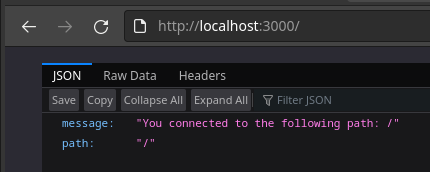
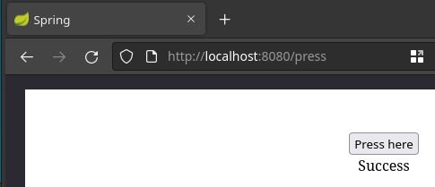

# Part 1

## Exercise 1.1: Getting started

---

Start 3 containers from image that does not automatically exit, such as nginx, detached.

```console
[dot@arch DevOpsDocker]$ docker container run -d nginx
[dot@arch DevOpsDocker]$ docker container run -d nginx
[dot@arch DevOpsDocker]$ docker container run -d nginx
```

Stop 2 of the containers leaving 1 up.

```console
[dot@arch DevOpsDocker]$ docker stop c0
[dot@arch DevOpsDocker]$ docker stop 1d
```

Output

```console
[dot@arch DevOpsDocker]$ docker ps -a
CONTAINER ID   IMAGE     COMMAND                  CREATED          STATUS                     PORTS     NAMES
a341601b46f6   nginx     "/docker-entrypoint.…"   53 seconds ago   Up 51 seconds              80/tcp    condescending_lehmann
1d5bc08d9236   nginx     "/docker-entrypoint.…"   54 seconds ago   Exited (0) 3 seconds ago             laughing_mahavira
c0a25c9b152e   nginx     "/docker-entrypoint.…"   55 seconds ago   Exited (0) 8 seconds ago             jovial_babbage
```

<br>

## Exercise 1.2: Cleanup

---

Cleanup containers & images

```console
[dot@arch DevOpsDocker]$ docker rm -f $(docker ps -aq)
[dot@arch DevOpsDocker]$ docker rmi c9
```

Output

```console
[dot@arch DevOpsDocker]$ docker ps -a
CONTAINER ID   IMAGE     COMMAND   CREATED   STATUS    PORTS     NAMES
[dot@arch DevOpsDocker]$ docker images
REPOSITORY   TAG       IMAGE ID   CREATED   SIZE
```

<br>

## Exercise 1.3: Secret message

---

Commands

```console
[dot@arch DevOpsDocker]$ docker run -dit --rm --name web devopsdockeruh/simple-web-service:ubuntu
[dot@arch DevOpsDocker]$ docker exec -it web bash -c "tail -f ./text.log"
```

Secret Message

```console
Secret message is: 'You can find the source code here: https://github.com/
```

<br>

## Exercise 1.4: Missing dependencies

---

Commands

```console
[dot@arch DevOpsDocker]$ docker run -dit --name web ubuntu sh -c 'apt update; apt install -y curl; echo "Input website:"; read website; echo "Searching.."; sleep 1; curl http://$website;'
[dot@arch DevOpsDocker]$ docker attach web
```

Input/Output

```console
Input website:
helsinki.fi
Searching..
<!DOCTYPE HTML PUBLIC "-//IETF//DTD HTML 2.0//EN">
<html><head>
<title>301 Moved Permanently</title>
</head><body>
<h1>Moved Permanently</h1>
<p>The document has moved <a href="https://www.helsinki.fi/">here</a>.</p>
</body></html>
```

<br>

## Exercise 1.5: Sizes of images

---

Size

```console
[dot@arch DevOps-docker]$ docker images
REPOSITORY                          TAG       IMAGE ID       CREATED         SIZE
devopsdockeruh/simple-web-service   ubuntu    4e3362e907d5   12 months ago   83MB
devopsdockeruh/simple-web-service   alpine    fd312adc88e0   12 months ago   15.7MB
```

Secret

```console
[dot@arch DevOps-docker]$ docker run -dit --rm --name alpine devopsdockeruh/simple-web-service:alpine
[dot@arch DevOps-docker]$ docker exec alpine sh -c "tail -f ./text.log"
Secret message is: 'You can find the source code here: https://github.com/docker-hy'
```

<br>

## Exercise 1.6: Hello Docker Hub

---

Command

```console
[dot@arch DevOps-docker]$ docker run -it devopsdockeruh/pull_exercise
```

Secret

```console
Give me the password: basics
You found the correct password. Secret message is:
"This is the secret message"
```

https://github.com/docker-hy/docs-exercise/blob/master/index.js

## Exercise 1.7: Two line Dockerfile

---

<strong>[Dockerfile](ex1.7/Dockerfile)</strong>

Command

```console
[dot@arch ex1.7]$ docker build . -t web-server
[dot@arch ex1.7]$ docker run web-server
```

Output

```console
[GIN-debug] [WARNING] Creating an Engine instance with the Logger and Recovery middleware already attached.

[GIN-debug] [WARNING] Running in "debug" mode. Switch to "release" mode in production.
 - using env:	export GIN_MODE=release
 - using code:	gin.SetMode(gin.ReleaseMode)

[GIN-debug] GET    /*path                    --> server.Start.func1 (3 handlers)
[GIN-debug] Listening and serving HTTP on :8080
```

## Exercise 1.8: Image for script

---

<strong>[Dockerfile](ex1.8/Dockerfile)</strong>

Command

```console
[dot@arch ex1.8]$ docker build . -t curler
[dot@arch ex1.8]$ docker run -it curler
```

Input/Output

```console
Input website:
helsinki.fi
Searching..
<!DOCTYPE HTML PUBLIC "-//IETF//DTD HTML 2.0//EN">
<html><head>
<title>301 Moved Permanently</title>
</head><body>
<h1>Moved Permanently</h1>
<p>The document has moved <a href="https://www.helsinki.fi/">here</a>.</p>
</body></html>
```

## Exercise 1.9: Volumes

---

Command

```console
[dot@arch DevOpsDocker]$ touch text.log
[dot@arch DevOpsDocker]$ docker run -d --name spammer --rm -v $(pwd)/text.log:/usr/src/app/text.log devopsdockeruh/simple-web-service
```

## Exercise 1.10: Ports open

---

Command

```console
[dot@arch DevOpsDocker]$ docker run -d --rm --name web -p 3000:8080 web-server
b38480db9b1b3abe861104b6ecdc94f83f88c2de0e60f1d961091045b02b9e53
[dot@arch DevOpsDocker]$ docker ps -a
CONTAINER ID   IMAGE        COMMAND                  CREATED         STATUS                   PORTS                    NAMES
b38480db9b1b   web-server   "/usr/src/app/server…"   3 seconds ago   Up 2 seconds             0.0.0.0:3000->8080/tcp   web
ae5f2dbaef8c   curler       "/bin/sh -c ./script…"   12 days ago     Exited (0) 12 days ago                            peaceful_matsumoto
```



## Exercise 1.11: Spring

---

<strong>[Dockerfile](ex1.11/Dockerfile)</strong>

Command

```console
[dot@arch spring-example-project]$ docker build . -t java-spring && docker run -d --rm --name spring -p 8080:8080 java-spring
```


